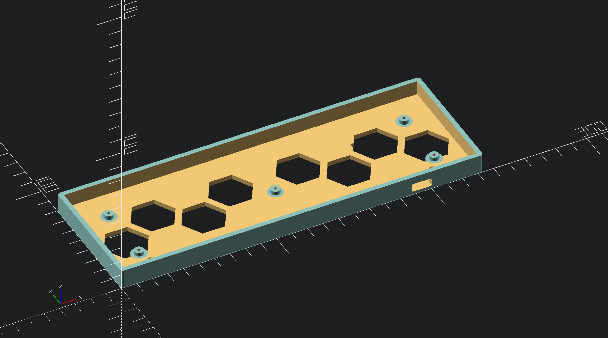

# bm40-keyboard-case
A 3d printable case for BM40 RGB mechanical keyboard PCB.
It's a super slim case, just wraps pcb and adds minimal space around.

It has quite a few features though:
- Mounting holes and designs for angling feets (if you like your keeb to be a bit angled)
- Grooves for 8mm adhesive silicone/rubber feet pads (also on angling feets)
- Nice looking hexagonal holes for underglow LEDs
- Holes for PCB mounting
- Hole to access Reset pads on PCB
- Minimal USB connector hole
- Switch plate for better stability (also in split and unsplit versions)
- Available in unsplit and split versions (for smaller 3d printers)

## How to get it

Just running a first print, so it's not tested yet. Just give me few more days to finish it up :)
If everything is OK I'll upload stl files for split and unsplit versions.

